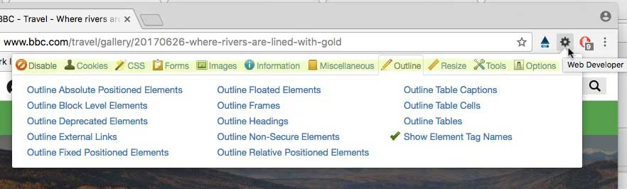
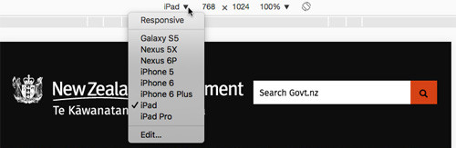
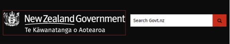
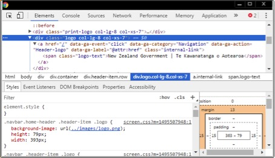

--- 
layout: assessment-guide 
title: Web Standards 2017 Self-Assessment Methodology 
draft: true 
---

## 1. Overview

Blurb about the web standards and WCAG.

This document details what someone needs to know to conduct the 2017 Web Standards Self-Assessment. It outlines the:

* tools needed and how to use them

* tests required as part of the Self-Assessment

* extra guidance for people less familiar with web accessibility.

### What we’re doing

The 2017 Self-Assessment is reducing the number of success criteria to be tested. Instead it focuses on the most common issues that were identified in the 2014 Self-Assessments. 

### What it doesn’t do

These tests can't tell you if your website is fully accessible or usable. If you want a full assessment, you need to test against all the requirements in the Web Accessibility and Web Usability Standards.

### How and when to use it

As well as using this document to conduct the 2017 Self-Assessment, organisations can also use it to:

* prioritise areas to improve

* report existing issues to management to get their support for training, remediation, resource allocation etc.

* raise web accessibility knowledge and skills among their staff

* test websites built by external companies for common accessibility issues

* apply the testing process throughout a website’s development lifecycle to ensure it is continually accessible.

### Assessment results

The Self-Assessment is meant to give organisations an indication of how well they are meeting the Web Standards, rather than how they rank against other organisations. The annual self-assessments will give them a way to measure their improvement over time.

**What you can do with the results**

The tests in this methodology are pretty black and white. There’s no weighting or percentage pass/fails. If you pass a test, it means all the content on that page passes. On the other hand, if a page fails only 1 of the 3 requirements involved in particular test, the page as a whole fails that test. Note down for your own use the things that need fixing and you can go back later and fix them.

### Future plans

We’re planning to review old issues and address new ones with different sets of tests every year. Over time we’ll build up a library of tests that addresses a greater number of Web Standards requirements.

## 2. Skills you need for doing the self-assessment

If you’re doing the 2017 Web Standard Self-Assessment, you need to:

* have basic knowledge HTML — enough to be able to inspect code and understand how elements are nested

* use Chrome with the [Web Developer](https://chrome.google.com/webstore/detail/web-developer/bfbameneiokkgbdmiekhjnmfkcnldhhm) and [aXe](https://chrome.google.com/webstore/detail/axe/lhdoppojpmngadmnindnejefpokejbdd) extensions installed

* have another browser (Internet Explorer or Firefox) for testing keyboard use.

* know your website well enough to pick pages based on their content.

We’ll be holding workshops to demonstrate the various testing techniques. Come along if you have questions. Someone will be there to answer any testing questions you have. If you're not sure how to use the software, bring a laptop with the software installed. We can show you how to use it and test your web pages.

Questions can also be submitted at any time to [web.standards@dia.govt.nz](mailto:web.standards@dia.govt.nz).

## 3: Tools you need — get set up to test

For the 2017 Self-Assessment we’ve introduced some automated testing. It can test about 25% of accessibility issues and for the rest we’ll use manual testing.

Automated testing is really easy, so let’s start with the manual testing.

The tools we’re using are the:

* Chrome’s built-in developer tools — to inspect a web page’s code

* Web Developer extension for Chrome — a semi-automated testing tool

* Chrome Device Mode — to simulate viewport sizes, and 

* aXe extension for Chrome — the automated testing tool.

### Developer tools

When you need to inspect the code, use built-in developer tools.

1. As a general rule, right-click on an element in the web page.

2. Select the option to inspect to open the developer tools. 

3. The element you clicked on will be highlighted. 

[Explore Chrome’s developer tools](https://developers.google.com/web/tools/chrome-devtools/) 

[Inspect and edit pages and styles in Chrome](https://developers.google.com/web/tools/chrome-devtools/inspect-styles/)

We recommend opening the developer tools either as a separate window or at the bottom of the screen. 

 If you’re new to using developer tools, try them out before starting the tests. And be sure to attend one or more of the self-assessment clinics that will be offered and ask for a demo.

### Web Developer extension

The web developer extension for Chrome has various features to help simplify accessibility testing. We’ll use it to speed up checking headings, lists and image alt text. But it’s well worth looking at the other things it has to offer.

#### Get the extension

[Download the Chrome extension](https://chrome.google.com/webstore/detail/web-developer/bfbameneiokkgbdmiekhjnmfkcnldhhm).

#### Use the extension

Once you’ve installed the extension, you can access it using the cog icon on the toolbar to the right of the address bar (shown below).

##### What you need to know

*  The highlighted area at the top is the menu. The Outline menu is shown.

* Any selected item will have a green tick next to it.

* To get rid of the pop up menu, just click in the page.

### Test with multiple viewport sizes

Accessibility issues that only appear on smaller screens will get picked up this way. As well as testing your pages at your browser’s normal desktop size, you also need to test at the following widths: 

* 320px - the size of a small screen mobile phone like an iPhone 5 in portrait mode

* 768px - roughly the size of a tablet like an iPad in portrait mode.

To simulate a mobile or tablet experience on a desktop computer, you can resize your browser to approximately the size of a tablet or a smartphone. You can also use some browsers’ built-in tools, like Chrome’s Device Mode, to help with this. 

#### [Using Chrome’s Device Mode]

[Using Chrome's Device Mode to simulate mobile devices](https://developers.google.com/web/tools/chrome-devtools/device-mode/)

To use the Device Mode in Chrome:

1. Open the developer tools.

2. Device Mode is the second button on the left-hand side of the toolbar at the top.

3. The browser will switch into Device Mode and the web page screen size will change. 

4. Choose the viewport size you need by:

    1. Clicking on dropdown on the toolbar above the smaller web page.

    2. Choose the device size you need.

[end]

### aXe automated testing tool

For automated testing, we recommend using aXe, an open-source accessibility testing tool that comes as a browser extension for Chrome. The download page tells you how to run it and interpret what you find.

[Download and use aXe for accessibility testing](http://www.deque.com/products/axe/)

## 4: How to pick pages for testing

copy into here. For GIS sanity testing, just pick a page known to have rich content on it.

# Tests for each page

## Test 1: Run the aXe automated testing tool

You need to run the aXe tool on each page you test. You also need to run it for each viewport because different responsive designs may present different accessibility errors.

1. Run the aXe extension in Chrome by opening the developer tools. To find them, right-click and choose inspect.

2. Along the top line you should be able to select aXe.

 

1. Hit the "Analyze" button.

2. In the left-hand pane, change "show:all" to “show: violations”.

3. Record a summary of the results into the reporting tool and save them. 

4. Note down the error message text and the number of violations for that message.

1. Resize your browser window to simulate a mobile device and test at the site’s other responsive layout widths. If they give different results, paste the results below the earlier ones and note what screen size it was.

## Test 2: Headings

**Impact of failure:** Failing this requirement means some people are denied contextual information which helps them understand how content is structured on the page.

**Related WCAG 2.0 success criteria:** [1.3.1 Information and Relationships](https://www.w3.org/TR/UNDERSTANDING-WCAG20/content-structure-separation-programmatic.html).

### How to test

1. If you have device mode on or the developer tools still open, close them.

2. On the page you’re testing, go to the Web Developer extension and select "Outline", then click:

    *  "Show Element Tag Names", and 

    * "Outline Headings". 

This will add a border around anything marked up as a heading and will show which heading tag, e.g. `<h3>`, has been used.

3. Record a failure if content is outlined as a heading, but doesn’t:

    * look like a heading, e.g. it is not larger and bolder, or 

    * act like a heading, e.g. it doesn’t introduce or describe the content after it.

4. If content looks like and acts like a heading, but isn’t outlined as a heading, inspect its code to see if the heading is wrapped in a basic element like a `
` or `
` with an ARIA role="heading" and an aria-level attribute to show what level it is. For example, `
About Us
`. If it isn’t, record this as a failure.

5. Check each heading to make sure the heading level is the appropriate given its position in the page’s content hierarchy. Otherwise, record this as a failure.

6. Remember to resize your browser window and test at the site’s other responsive layout widths.

### [More information about headings]

Information, structure, and relationships conveyed through presentation must also be reflected with proper HTML markup.

 A heading introduces or describes the content that follows it. It should also stand out from the rest of the page. If something looks and acts like a heading, it should be marked up as an HTML heading. Similarly, something that is marked up as an HTML heading should look and act like a heading.

Headings establish a hierarchy or ranking. An `<h1>` has the highest ranking and `<h6>` has the lowest. So headings need to reflect the content hierarchy.  

Think about whether your content is structured logically. Content structure should reflect a clear hierarchical order.

Skipping heading levels, e.g. going from `<h1>` to `<h3>`, is not advised, but it is not a WCAG failure. A level 3 heading `<h3>` can be a subheading under a level 1 `<h1>` heading, because an `<h3>` is of a lower rank than both `<h1>`. But the reverse, using an `<h2>` as a subheading to an `<h3>` is considered a failure, because an `<h2>` is of a higher rank than an `<h3>`, and therefore doesn’t make sense as a subheading to an `<h3>`.

Note: the heading that introduces the main content is usually the heading with the highest rank on the page, even if it isn’t the first heading on the page. Often menus or navigation items have headings and appear before the main content heading on the page. This is fine as long as they’re a lower ranked heading than the one introducing the main content.

[end]

## Test 3: Lists

**Impact of failure:** Failing this requirement means some people are denied important contextual information that helps them understand the content’s structure and meaning as it is shown on the page.

**Related WCAG 2.0 success criteria:** [1.3.1 Information and Relationships](https://www.w3.org/TR/UNDERSTANDING-WCAG20/content-structure-separation-programmatic.html).

### How to test

1. Scan the page you’re testing for content presented as a list of items.

2. Open the Web Developer extension and select "Outline", and “Outline Block level elements”. 
This will show you, among other things, all the headings, lists and tables on the page. It will also indicate which tag, e.g. `<ul>`, has been used to mark up each element.

3. Make sure that the list uses the correct HTML markup for the type of list it is: 

    * `<ol>` or `<ul>` and `<li>` for numbered or bulleted lists, e.g.

    * `<dl>`, `<dt>` and `<dd>` for description or definition lists, e.g.

4. If the list does not use the correct HTML markup, record this as a failure.

5. If the list uses the wrong list type, e.g. a sequence of steps is marked up as a `<ul>` instead of an `<ol>`, record a failure.

6. Remember to resize your browser window and test at the site’s other responsive layouts.

### [More information about lists]

There are 3 types of list in HTML:

* unordered lists

* ordered lists

* description or definition lists. 

#### Unordered lists

These lists are used where the order of the list items doesn’t matter. They’re marked up using the `<ul>` element. Each list item is preceded by a simple bullet or similar. 

In unordered lists, the individual list items are marked up as `<li>` elements.

##### Example

`<ul>`
	`<li>An item in an unordered list</li>`
	`<li>Another list item</li>`
	`<li>One more item</li>`
`</ul>`

#### Ordered lists

These lists are used where the order of the list items has an impact on their meaning. They’re marked up with an `<ol>` element. Each list item in an ordered list is preceded by a number or letter. These can be arabic numerals, roman numerals, upper or lowercase letters.

In ordered lists, the individual list items are marked up as `<li>` elements.

##### Example

`<ol>`

	`<li>First item in an ordered list</li>`
	`<li>Second list item</li>`
	`<li>The third and last item in this list</li>`

`</ol>`

#### Description or definition lists

These are used for groups of terms and their descriptions or definitions, as might be found in a glossary, or a collection of questions and answers. The list is contained in a `<dl>` element. Each term in the group uses a `<dt>` element and each associated description or definition uses a `<dd>` element. 

Example

##### Example

`<dl>`

`<dt>browser</dt>`

	`<dd>A software application for navigating information resources on the World Wide Web</dd>`
	
`<dt>web</dt>`
	`<dd>The structure spun by a spider using silk secreted from its abdomen.</dd>`
	`<dd>The World Wide Web hypertext system that operates over the Internet.</dd>`
	
`</dl>`

[end]

## Test 4: Tables

**Impact of failure:** Failing this requirement means some people won’t be able to associate table data with the row and column headers that give it context, and are consequently unable to make sense of the data.

**Related WCAG 2.0 success criteria:** [1.3.1 Information and Relationships](https://www.w3.org/TR/UNDERSTANDING-WCAG20/content-structure-separation-programmatic.html).

### [What you should know about tables]

#### Data tables

You have a data table if you need column headers and/or row headers to explain what the information in the cell means.

Otherwise it’s a layout table.

A data table’s column and row structure is expressed using the proper HTML markup.

##### Simple tables

Simple tables have one row of column headers and maybe one column of row headers as well. The easiest way to make a simple table accessible is to markup column and row headers with `<th>` header elements. The header content describes what each column or row of cells represents. Sometimes header cells use the scope attribute, e.g. `<th scope="col">` to emphasise that the header applies to the entire column or row, but it isn’t necessary for a simple table. 

###### Example of a simple table

<table>
  <tr>
    <td>Destination</td>
    <td>Name</td>
    <td>Departure date</td>
  </tr>
  <tr>
    <td>Vienna</td>
    <td>Hilary Bell</td>
    <td>4 October 2009</td>
  </tr>
  <tr>
    <td>Cairo</td>
    <td>Sarah Fisher</td>
    <td>7 October 2009</td>
  </tr>
</table>

For an example of a simple table using `<th>` and scope attributes for both column and row headers, see the [table for the Web Accessibility Standard’s implementation schedule](https://webtoolkit.govt.nz/guidance/about-the-standards/about-the-web-accessibility-standard/#implementation). 

##### Complex tables

Complex tables have multiple levels of row or column headers. Straightforward complex tables may only need to use  the scope attribute to clarify how the column or row header cells apply to the different columns and rows. 

**_Example of a basic complex table_**
<table>
  <tr>
    <td>Destination</td>
    <td>Name</td>
    <td>Departure date</td>
  </tr>
  <tr>
    <td rowspan="2">Vienna</td>
    <td>Hilary Bell</td>
    <td>4 October 2009</td>
  </tr>
  <tr>
    <td>Nicola Chang</td>
    <td>5 October 2009</td>
  </tr>
  <tr>
    <td>Munich</td>
    <td>Sarah Fisher</td>
    <td>7 October 2009</td>
  </tr>
</table>

###### More complicated tables

These can still be made accessible if you use:

* header and id attributes, or

* ARIA rowheader  or columnheader roles.

For tables with multi-level headers, use header and id attributes. Each header should be given a unique id and each data cell has a headers attribute that references all the relevant header cells id values.

 An example of this is Table 4 on this page: [http://www.treasury.govt.nz/budget/forecasts/hyefu2016/107.htm](http://www.treasury.govt.nz/budget/forecasts/hyefu2016/107.htm)

You can also use the ARIA role rowheader or columnheader on the header cell’s element if a table uses:

* `<td>` instead of `<th>`, or

* divs and spans instead of standard HTML table markup.

#### Layout tables

If a layout table is used, it must not include any of following HTML elements and attributes:

* `<th>`, `<thead>`, `<tfoot>` and `<caption>` elements

* summary, scope or headers attributes.

If the table has any of these, the `<table>` element must have a role with a value of "presentation" or “none”, e.g. `<table role=“presentation”>`. This tells the browser and assistive technologies to ignore the table markup and just read the content as if it the table structure wasn’t there.

[/end]

### How to test

1. Scan the page you’re testing for tables.

2. For each table, decide if it’s a data table or a layout table.

3. Inspect the source code associated with each table.

#### Data tables

1. Look at each data table. Is it simple or complex?

2. Look at the markup of its column and/or row headers. Once you record a pass you can move to the next test. Inspect the code in the header cell for any of the following:

    * is marked up with a `<th>` element — most appropriate for simple tables

    * uses a `<th>` with a scope attribute e.g. `<th scope="col”>` for a column header, or `<th scope="row”>` for a row header — mostly used for complex tables

    * has an id attribute, and the data cell references that id value using a headers attribute  — mostly used for complex tables

    * doesn’t use `<th>` but instead uses the ARIA role rowheader or columnheader in the header cell element.

3. If none of these options have been used to markup the header cell, record a failure.

#### Layout tables

4. If it’s a layout table, record a failure if the `<table>`  has any of the following:

    * `<th>`, `<thead>`, `<tfoot>` and `<caption>` elements

    * a summary attribute on the `<table>` element

    * scope or headers attributes on `<td>` elements.

5. Remember to resize your browser window and test at the site’s other responsive layouts.

### Other failure points

If you happen to see this, record a failure.

* A table uses id and headers attributes but associates content cells with the wrong header cells.

## Test 5: Keyboard use

**What you need:** Don’t use Chrome or Safari for this test — those browsers may add their own visible indication of keyboard focus.

**Impact of failure:** Failing this requirement means people who use a keyboard or other assistive devices instead of a mouse can’t use your site.

**Related WCAG 2.0 success criteria:** [2.1.1 Keyboard](https://www.w3.org/TR/UNDERSTANDING-WCAG20/keyboard-operation-keyboard-operable.html); [2.4.7 Focus Visible](https://www.w3.org/TR/UNDERSTANDING-WCAG20/navigation-mechanisms-focus-visible.html); [2.1.2 No Keyboard Trap](https://www.w3.org/TR/UNDERSTANDING-WCAG20/keyboard-operation-trapping.html).

### How to test

Basic keyboard testing is easy. You’ll mostly use the Tab, Enter and arrow keys as well as the Spacebar. 

[WebAIM: More detailed keyboard testing](http://webaim.org/techniques/keyboard/#testing)

You need to test keyboard use for any type of content on your page. Not all the features below will appear on your page at the same time. Test whatever features you have, except for visible focus. Visible focus must be tested on every page.

1. Starting in the address bar, use the Tab key to move through the page. Use Shift-Tab if you need to move backwards. 

#### Visible focus 

2. While you move through the page, make sure you can see where the current focus is. 
Record a failure of visible focus if you can’t see anything. If it’s there but hard to see, just note it in the report. 

#### [**_More about visual focus]_**

As you Tab through the website, keep in mind that there should be a visible focus indicator showing you where your keyboard focus is. It must be something that’s easy to see, like a border or highlight.

Depending on backgrounds and the style of the focus indicator, it can sometimes be hard to see rather than completely invisible. If you can see it, even if it doesn’t really stand out, simply note it in the report rather than recording a failure.

Also remember that unlike screen readers, you won’t see focus move to everything on the page. Items that you can’t interact with, like headings or body text, don’t take keyboard focus. But items like forms, links, carousel controls, buttons, videos, dialog boxes do need interaction, so when they get keyboard focus, it should be visible to users.

[/end]

#### Links and buttons

3. Tab to every link and press Enter.  Use the browser’s back button to go back to the previous page.
Record a failure of keyboard functionality if the link doesn’t work with the Enter key. 

4. While you’re testing links, check that any information presented when you hover your mouse over the link also appears when the link gets keyboard focus.
Record a failure of keyboard functionality if it doesn’t.

#### [Extra information on mouse hover]

Sometimes extra information presented to someone when they hover their mouse over an object on the page. This information must also be presented when it gets keyboard focus.

[/end]

5. Tab to each button and press the Spacebar. Check that the button performs the same action as when clicked on with a mouse. If you can’t activate the button with the Spacebar, record this as a failure of keyboard functionality. 

#### Popup boxes

1. If a popup box (sometimes known as a modal or lightbox) appears, check that you can do the following:

    1. easily move around the box 

    2. use everything in the box without using a mouse

    3. close the box by either hitting the Esc key, or navigating to a close or cancel button.

2. If you can’t do all these things with the keyboard alone, record a failure of keyboard functionality.

1. If the box is a modal or lightbox, make sure your tabbing is being restricted to the box. If you tab past the last item in the box, focus needs to loop to the beginning of the box. 
Record a failure of keyboard functionality if the keyboard focus continues on in the background, then close the box and keep testing.

#### [More about **_Popup boxes]_**

Modal or lightboxes are meant to stop the user from doing anything else on the page until they’ve finished with the box. An example is an image gallery lightbox — while viewing the images, the page content behind it is not available.

Typically the rest of the page will be partly dimmed to show that mouse users can’t click on anything outside the box. Keyboard focus should also be trapped within the box, and all content outside it should be unavailable to assistive technologies like screen readers.

[/end]

#### Videos and carousels

1. Check that you can use the keyboard to control things like videos, carousels, sliders. Record a failure of keyboard functionality where you can’t.

    * If your page has an embedded video, can you:

        * get to the video with the Tab key?

        * use each control in the player using some combination of Enter, Spacebar, or arrow keys? 

        * use the Tab key to move past the video player and down to any focusable elements that follow it?

    * If the page contains a carousel, can you:

        *  use the keyboard to set focus to and activate each of its controls?

        * switch between its panels?

#### Forms

1. Check that you can use the keyboard to complete a form. Record a failure of keyboard functionality where you can’t.
If your page has a form, can you use the:

    * Tab key to get to each form field?

    * arrow keys in a group of radio buttons to change which radio button is selected?

    * Spacebar to check or uncheck a checkbox? 

    * date picker/calendar widget by:

        * navigating the day, week, month and year using the Tab and/or arrow keys?

        * select a specific date with the Enter key or Spacebar?

    * up/down arrow keys to choose from drop-down options?

    * enter key to submit the form?

1. Remember to resize your browser window and test at the site’s other responsive layouts.

### [If you need more information about keyboard use]

The keyboard is one of the more fundamental assistive devices because many other assistive technologies translate their commands into what are effectively keyboard commands. This means that a keyboard accessible website has a better chance of being usable with assistive technologies.

### Other failure points

If you happen to see this, record a failure.

* Focus disappears from an element just as or right after it receives visible focus.

## Test 6: Images

**Impact of failure:** Failing this requirement means that users who can’t see non text content, like images, diagrams and charts, can’t get access to the information contained there.

**Related WCAG 2.0 success criteria:** [1.1.1 Non-text content](https://www.w3.org/TR/UNDERSTANDING-WCAG20/text-equiv-all.html); [4.1.2 Name, role, value](https://www.w3.org/TR/UNDERSTANDING-WCAG20/ensure-compat-rsv.html).

### How to test

1. Find all the images in the content of the page. The easiest way to do this is to:

    *  In the Web Developer extension, select "Images"

    * check, "Outline All images". 

    * This highlights all images in the page content.

1. Assess each image like this:

1. If any image does not have an alt attribute, record a failure and go to the next test.

2. Is the image part of a link? If it’s not, move on to number 3. If it is, inspect it to view the alt text. It must meet one of these criteria:

<table>
  <tr>
    <th>Type of image link</th>
    <th>What it needs to be accessible</th>
  </tr>
  <tr>
    <td>The link contains just the image with no surrounding words.
 </td>
    <td>The alt text must describe the link’s purpose or destination — rather than describe the image itself, e.g. the alt text for a Twitter icon might be ‘Tweet this page’.</td>
  </tr>
  <tr>
    <td>The link contains an image and text that describes the link’s purpose or destination.</td>
    <td>The alt text should be empty, i.e. alt="".</td>
  </tr>
  <tr>
    <td>The link contains an image and text, but the image has meaningful information that isn’t in the link text.</td>
    <td>Include the extra meaningful information from the image in the image’s alt text.</td>
  </tr>
</table>

1. Ask yourself these questions about the image:

    * Is there meaningful information in this image or is it purely decorative?

    * If it is meaningful, how would you express the information in words?

    * Does the image contain words?

The image must meet one of these criteria:

<table>
  <tr>
    <th>Type of image</th>
    <th>What it needs to be accessible</th>
  </tr>
  <tr>
    <td>The image has meaningful information.</td>
    <td>It needs a text alternative (alt text, max ~150 characters) to replace the meaningful information in the image, e.g. alt="Alt text".</td>
  </tr>
  <tr>
    <td>The image contains words.</td>
    <td>Include the words in the image in the image’s alt text, e.g.  alt=“Alt text representing all the words in the image”.</td>
  </tr>
  <tr>
    <td>The image is purely decorative.</td>
    <td>The image’s alt text should be empty, i.e. alt="". Note: Leaving out the alt attribute altogether makes the image inaccessible and should be recorded as a failure.</td>
  </tr>
  <tr>
    <td>The image is too complex to describe with just alt text, e.g. a  chart, graph or infographic.</td>
    <td>Provide both alt text and a longer text alternative to relate the image’s meaningful information. This can be done in a number of ways:
    * use a longdesc attribute that links to the description of the image, e.g. ``
    * put the image and the long description text together in a `<figure>` element
    * include the long description as text immediately following the image.</td>
  </tr>
</table>

#### [Complex images]

For complex content images, the long text alternative can be provided in a number of ways. An image’s long text alternative is supposed to be programmatically associated with the image, so that machines can tell they are related. This can be done in several ways, but for the purpose of this methodology, it is sufficient if a suitable long text alternative is available on the same page next to its associated image, or on another web page clearly linked to from the image or a link next to the image.

[/end]

1. If you have images that automatically change on a page, make sure that each newly displayed image has appropriate alt text reflecting that image:

    1. Inspect the code to read the first image’s alt text.

    2. Check that the alt text for the first image matches the image.

    3. Wait until the next image loads and then make sure that the alt text has changed to match the new image. Record a failure if it doesn’t.

2. Check for any images that contain meaningful information but haven’t been outlined. 

#### [Find and test background images]

##### Finding CSS images

Outline images using the Web Developer extension as shown in Step 1.If you can’t find an `` element when you inspect the code for an image, it’s probably been added as a background image using CSS.  The easiest way to confirm this is with the Web Developer extension. 

1. Open the Web Developer extension and select ‘Images > Outline Background Images’.  This will add a visual border around each CSS background image on the page. 

2. For each background image outlined on the page, inspect the code for the element to which the CSS background image is attached.

3. Once you find it, look for the text alternative in the code.

##### How to inspect code to find the CSS image

For example, the [Govt.nz website](https://www.govt.nz/) uses a CSS background image for the linked New Zealand Government logo in the site banner.

1. Right-click on the image and inspect the code. The developer tools window opens and highlights an `<a>` element in the page.

2. Look in the Styles panel for something that says background or background-image with a url(...) in its value. It will usually be near the top.

3. The `<a>` element you’re currently inspecting doesn’t have a background image attached, so try inspecting its parent element, in this case the `
` containing the link. You’ll see the `
` has a background-image with a url(...) in the value, so you’ve found the right element.

4. That `
` contains a link, which you’ve already inspected. Inside that `<a>` element is a `` containing text that matches the text in the logo image. That text may not be visible to sighted users, but it serves as the text alternative for the CSS background image. It also serves as the link text for the link.

##### Alt text for CSS images

Background images inserted using CSS should only be used for decorative images because you can’t yet put alt text on one. If they convey meaningful information they must have a text alternative near where the image appears. There are a number of ways to do this:

* Add text but hide it offscreen so it isn’t visible, but is available to a screen reader user.

* Assign the element that has the CSS image a role of image (role="img") and use an aria-label attribute for the alt text.

[end]

1. Remember to resize your browser window and test at the site’s other responsive layouts.

### [If you need more information about images and alt text]

#### Text alternatives

Images that aren’t just decorative must have a text alternative that could replace the meaningful information in the image. This is called alt text and it’s usually done by using the alt attribute on the `` element that inserted the image in the page. Decorative images have an empty alt attribute ``.

People don’t always agree on what the correct alt text should be.  If you feel the alt text reasonably serves as a text replacement for the content of the image, given its surrounding context, that’s enough to pass the test.

Every meaningful image in a page needs a short (~150 characters) alt text. Complex images, e.g. charts, may also need a long text description to cover the detail in the image.

EXAMPLES

### Other failure points

If you happen to see any of these, record a failure.

* An image conveys information using different colours, but the alternative text doesn’t include that information.

* A link contains only an img element with an empty alt attribute. Record a failure of 4.1.2.

## Test 7: Captions and transcripts

**Impact of failure:** Failing this requirement excludes the deaf or hearing-impaired from accessing video or audio content. It also denies the benefits of captions to anyone in a noisy environment or who can’t access audio content.

**Related WCAG 2.0 success criteria:** [1.2.2 Captions (Prerecorded)](https://www.w3.org/TR/UNDERSTANDING-WCAG20/media-equiv-captions.html); [1.2.3 Audio Description or Media Alternative (Prerecorded)](https://www.w3.org/TR/UNDERSTANDING-WCAG20/media-equiv-audio-desc.html); [4.1.2 Name, role, value](https://www.w3.org/TR/UNDERSTANDING-WCAG20/ensure-compat-rsv.html).

### How to test

1. Look for any video or audio content on the page.

2. Play the content.

#### Captions

3. If it’s a video, while it’s playing, turn on captions.

4. If there aren’t captions, check if the content is high-stakes content? If the content is high-stakes and there are no captions, record a failure.

##### [High-stakes content]

high-stakes content is critical content that people need. Examples include content about:

 * civil emergencies and responses

 * entitlement or access to benefits, education, consumer or other community protections, passports, or visas

 * rights in criminal and civil proceedings

 * central government elections or referenda

 * tax obligations and rebates

 * general health information, specific health advice, health and safety in employment.

[/end]

5. If there aren’t captions and it’s not high-stakes content, was it published within the last 10 business days? If not, record a failure.

##### [Videos published in the last 10 days]

There is a grace period of 10 business days from the publish date to provide captions. To find out when it was published:

* Click on the YouTube icon (next to the cog) to view the video information in YouTube.

* The publish date will be underneath the share icon.

[/end]

6. If there are captions, check they are an accurate rendition of all meaningful audio information. If not, record a failure.

##### [What is considered meaningful]

7. Check that you don’t have auto captions turned on. If you’ve only got auto-captions, record a failure.

##### [Auto captions]

Don’t rely on auto-captions — they often don’t reflect what’s actually being said because of the differences in people’s ways of speaking. Automatic captions aren’t accessible because they’re not accurate enough. Captions in the specific language need to be listed.

To find out what captions you’ve got:

1. click on the cog (Settings) under the video

2. look at the caption options for Subtitles/CC.

3. If the option selected says English (auto-generated), these are auto captions.

[/end]

8. Check the page for a text transcript for any video or audio content. If there’s no transcript, record a failure.

9. If there’s a transcript, is it clearly labelled as being a transcript? If not, record a failure.

10. Compare the transcript with the video/audio content. Is it an accurate reflection of the meaningful audio or visual information? If not, record a failure.

11. Right-click and look at the page source (not the inspector):

* Do a search for "<iframe".

* If you find an iframe look for a title attribute with a descriptive name.

* If the iframe doesn’t have one, record a failure for WCAG 4.1.2 (Name, role, value).

### [If you need more information about captions and transcripts]

#### Captions

Videos need captions, sometimes called subtitles.  Captions provide a text version of what people are hearing on video or audio content.

#### Descriptive text transcript

Video and audio content needs a descriptive text transcript. 

A descriptive text transcript is a written description of all the meaningful visual and audio information in the video or audio content.

A transcript allows a:

* person to read the transcript and find out what’s in the content

* person to search for keywords in the content

* search engine to index the content.

### Failure points

If you happen to see this, record a failure.

* There is no descriptive text transcript for any video and audio content.

## Glossary

**CSS**: Cascading Style Sheets. These are the most common way to describe how HTML elements should look on a page.

**focus**: when you use the Tab key to "tab" through a web page, the browser sets keyboard “focus” to each interactive component (e.g. links, buttons, text inputs, etc). When something has focus, you’re able to interact with it using your keyboard, like pressing Enter on a link. There should also be some kind of visual focus indicator that makes it clear to sighted users which element currently has focus.

**high-stakes content**: critical content that people need. Examples include content about:

* civil emergencies and responses

* entitlement or access to benefits, education, consumer or other community protections, passports, or visas

* rights in criminal and civil proceedings

* central government elections or referenda

* tax obligations and rebates

* general health information, specific health advice, health and safety in employment.

**viewport**: the visible part of a web page. If the web page is larger than the viewport, the user can move the viewport around by scrolling vertically or horizontally. Or else the page resizes to fit all the content on a different-sized screen.

**visual label**: a label you can see that tells you what to enter in a form field.

## Web Usability Standard

<table>
  <tr>
    <td>Usability 2.4.2 Website's privacy statement has required content</td>
  </tr>
  <tr>
    <td>Usability 2.2.4 Website's 'Contact us' page has required content</td>
  </tr>
  <tr>
    <td>Usability 2.3.3 Unambiguous link on home page to website's general copyright statement</td>
  </tr>
  <tr>
    <td>Usability 2.4.3 Unambiguous link on home page to website's privacy statement</td>
  </tr>
</table>

